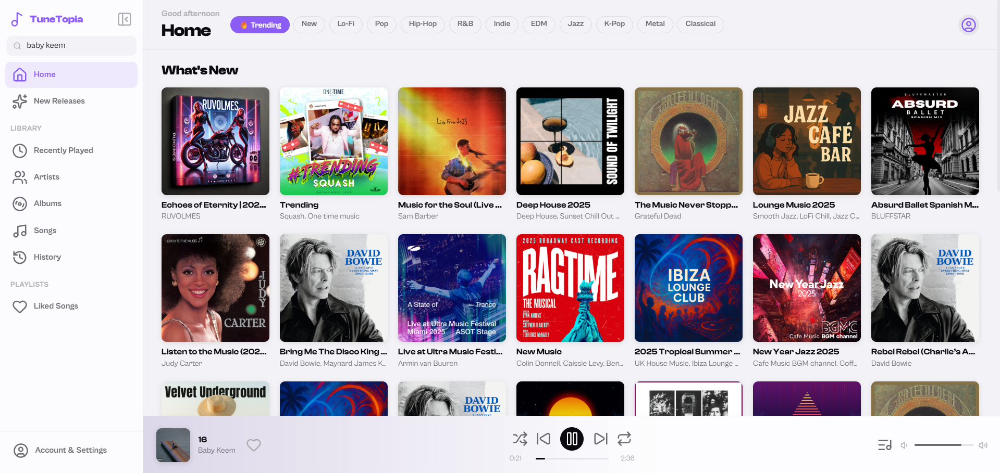
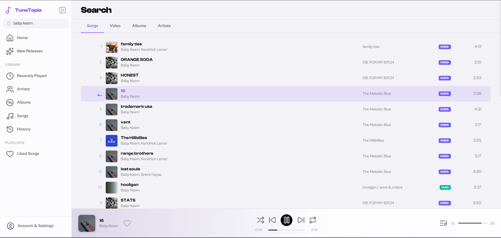
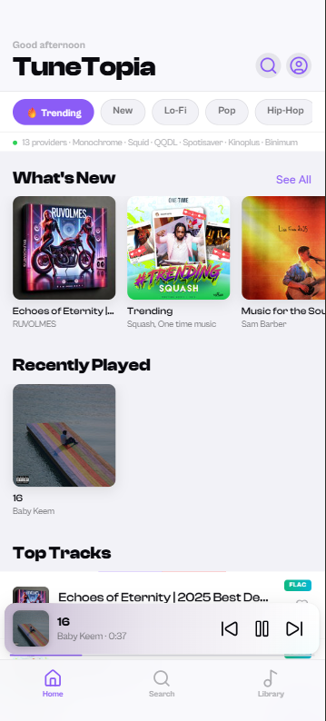
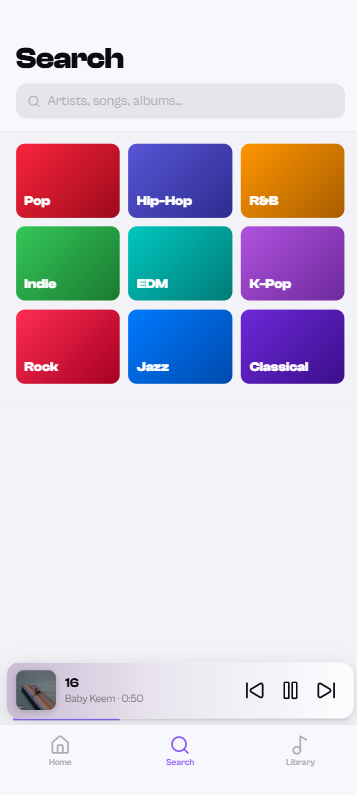
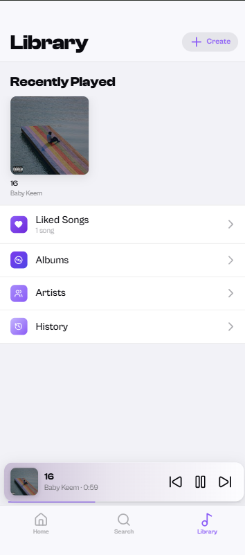
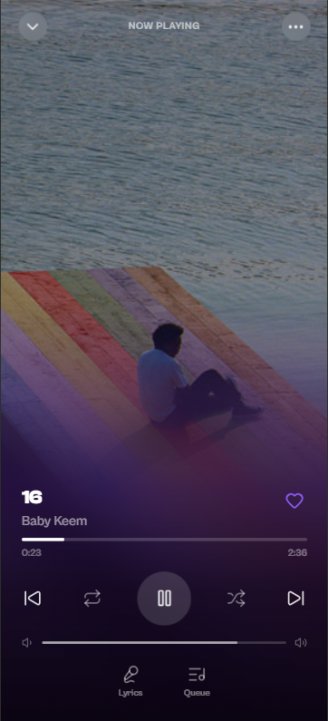

# TuneTopia 

A mobile-first music streaming web app with HiFi audio support, YouTube fallback, and a full desktop experience. No backend required — runs entirely in the browser.

---

## Features

- **HiFi streaming** via multiple Tidal-compatible providers (Monochrome, Squid, QQDL, Spotisaver, Kinoplus, Binimum)
- **YouTube fallback** via Invidious when HiFi providers are unavailable
- **DASH + direct stream** playback with automatic quality selection
- **Full Now Playing screen** with immersive blurred artwork, dynamic album-color gradients, lyrics panel, and queue panel
- **Liked Songs** with persistent localStorage storage, sort, and search-within
- **Play history** — last 80 tracks remembered across sessions
- **Responsive** — mobile UI below 900px, full desktop layout above 900px
- **Lucide icons** throughout

---

## File Structure

```
index.html   — All HTML: mobile pages, Now Playing overlay, desktop shell
style.css    — All styles: mobile, Now Playing, desktop (single file)
app.js       — Mobile App logic + Desktop App logic + shared LikedSongs module
ui.js        — All UI render functions (tracks, albums, artists, panels, etc.)
player.js    — Audio engine: play, queue, seek, volume, shuffle, repeat, history
api.js       — API layer: HiFi providers, Invidious, search, stream, normalization
```

---

## How It Works

### Providers (`api.js`)
Searches and streams are attempted across all configured provider base URLs in order. The first one to respond successfully is used.

```
HiFi providers → tryBases(ALL_HIFI_BASES, path)
YouTube        → Invidious instance (iv.melmac.space)
```

Stream quality ladder for HiFi tracks:
```
LOSSLESS → HI_RES_LOSSLESS → HIGH → YouTube fallback
```

### Player (`player.js`)
Wraps a native `<audio>` element. Handles:
- Direct URL playback
- DASH manifest playback via `dashjs` (loaded on demand)
- Queue management with shuffle/repeat
- Volume and seek persistence

### UI rendering (`ui.js`)
All rendering is done via `innerHTML` string templates. After any dynamic render, `lucide.createIcons()` is called on the new nodes to initialize icons.

Album color extraction uses a 40×40 canvas sample of the artwork to compute an average RGB, which is then applied as CSS variables for gradient theming across the mini player, Now Playing screen, and desktop bottom bar.

### App logic (`app.js`)
Two IIFE modules:
- `App` — mobile pages, search, library, liked songs, player controls wiring
- `DesktopApp` — desktop sidebar, page routing, bottom bar, search
- `LikedSongs` — shared localStorage module used by both

---

## Dependencies (CDN, no install)

| Library | Purpose |
|---|---|
| [Lucide](https://lucide.dev) | Icons (`unpkg.com/lucide@latest`) |
| [Clash Display + Cabinet Grotesk](https://fontshare.com) | Typography |
| [dash.js](https://github.com/Dash-Industry-Forum/dash.js) | DASH stream playback (loaded on demand) |

---

## Browser Support

Works in any modern browser. Requires:
- `fetch` API
- `<audio>` with FLAC/Opus/WebM support (all modern browsers)
- `backdrop-filter` for glass effects (Chrome, Safari, Edge — Firefox needs flag)
- `localStorage` for history and liked songs

---

## Known Issues

See [`progress.md`](./progress.md) for a full list of bugs and missing features.

Key ones to be aware of:
- Fast clicking tracks can cause a race condition where the wrong stream loads
- Lyrics panel shows a placeholder — lyrics API not yet integrated
- Album drilldown is not implemented (clicking an album shows a toast)
- DASH stream errors are silently swallowed in the quality fallback loop

---

## Providers

TuneTopia uses publicly available API endpoints. Provider availability may change. If all HiFi providers fail for a track, it automatically falls back to YouTube via Invidious.

---

## License

Personal / educational use. Streaming providers are third-party services — use responsibly and in accordance with their terms.

---

## Screenshots

1. *Desktop*

a. Home


b. Search


c. Library

Its just history for desktop and has to be made

2. *Phone*

| Home | Search | Library | Now Playing |
| ------------- | ------------- | ------------- |------------- |
|   |  |   |  |