# TuneTopia

**TuneTopia** is a high-fidelity, privacy-focused music streaming web application. Built with a "no-framework" philosophy, it leverages Vanilla JavaScript and modern Web APIs to deliver a premium experience using Tidal and YouTube as backends - without subscriptions, advertisements, or tracking.

---

# Key Features

### Audiophile Grade Streaming
- **Lossless & Hi-Res:** Direct access to FLAC (16-bit/24-bit) and AAC streams via Tidal's open proxy network.
- **Hybrid Engine:** Automatic fallback to YouTube (Invidious) when Tidal tracks are unavailable.
- **Advanced Playback:** True gapless playback using dual-buffer logic.
- **10-Band EQ:** Integrated parametric equalizer with genre-based presets.

### Sound Capsule (Local Analytics)
- **Privacy-First:** All listening history and stats are stored locally on your device.
- **Deep Insights:** Visualize your music journey with peak hour charts, artist discovery counters, and interactive listening heatmaps.

### Modern Web Experience
- **PWA Support:** Install TuneTopia on mobile or desktop for an app-like experience with offline shell support.
- **Synced Lyrics:** Real-time, time-synced lyrics powered by LRCLIB.
- **Responsive Design:** A beautiful "Warm Espresso" palette that scales from small mobile screens to ultra-wide monitors.

---

## 📸 Screenshots

| Mobile | Desktop |
|--------|---------|
| 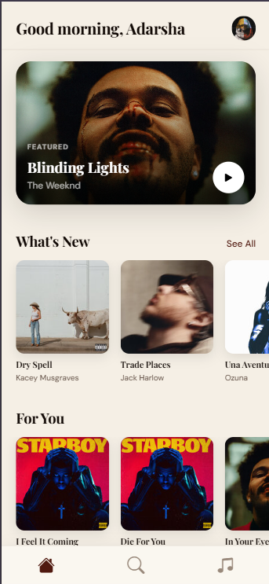 | 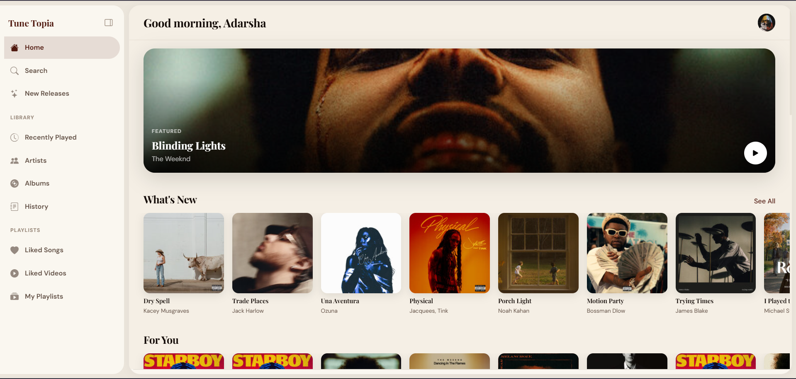 |
| 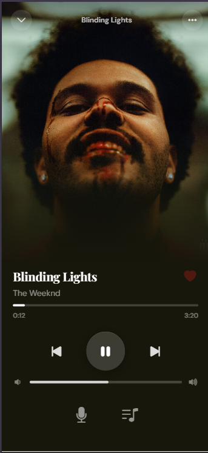 | 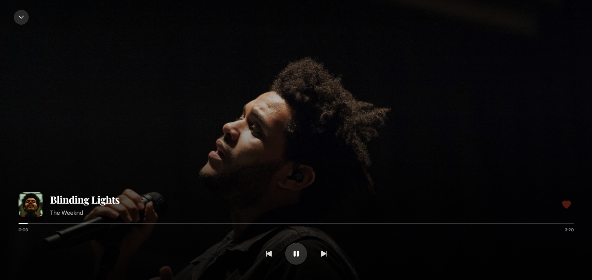 |
| 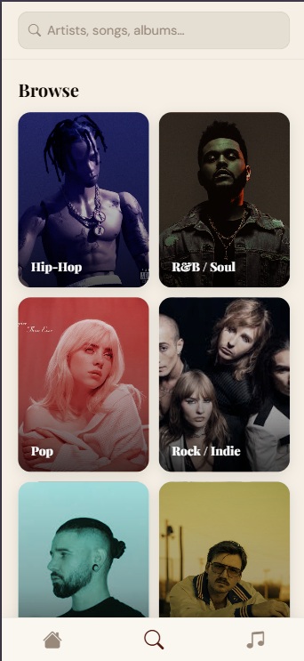 | 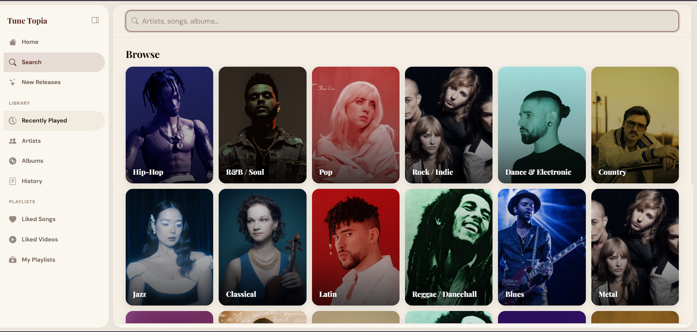 |
| 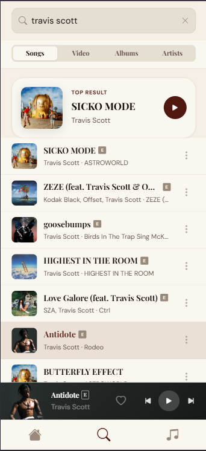 | 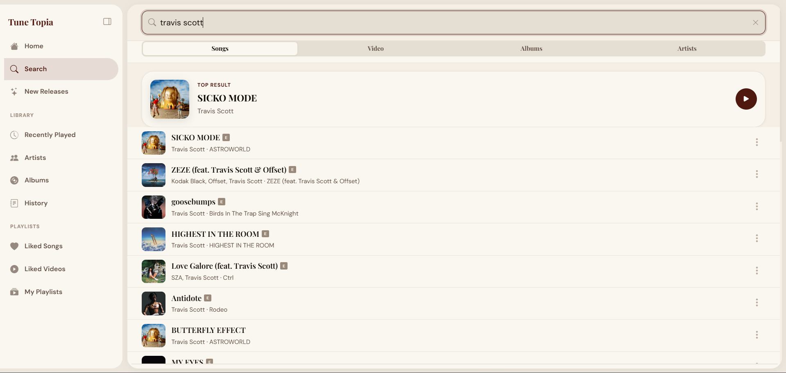 |
| 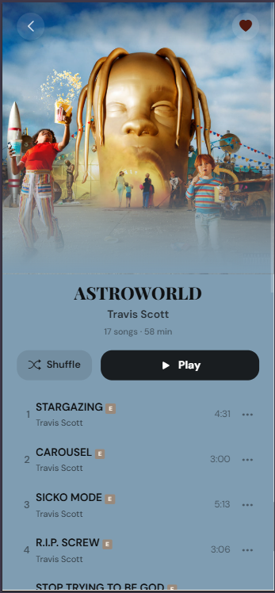 | 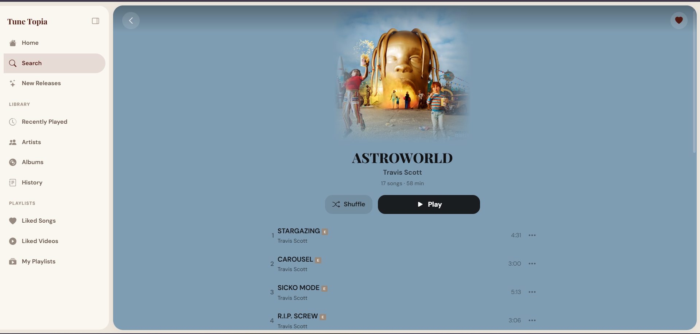 |
| 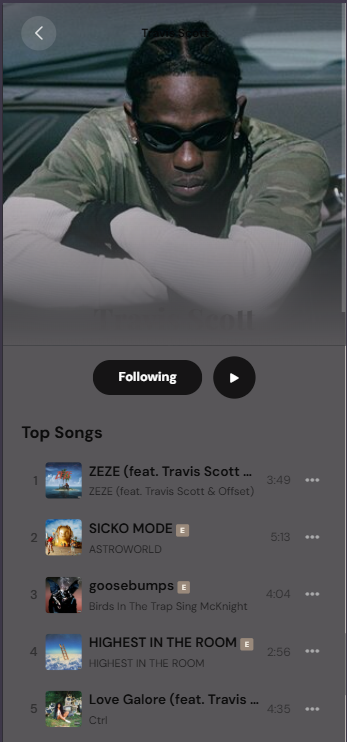 | 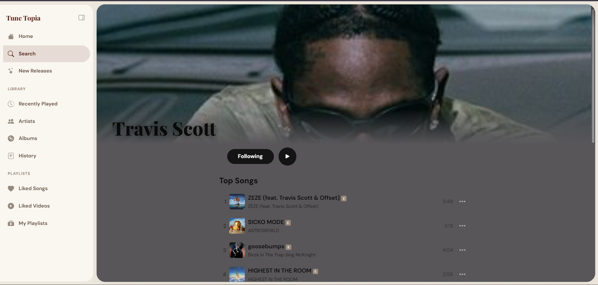 |
| 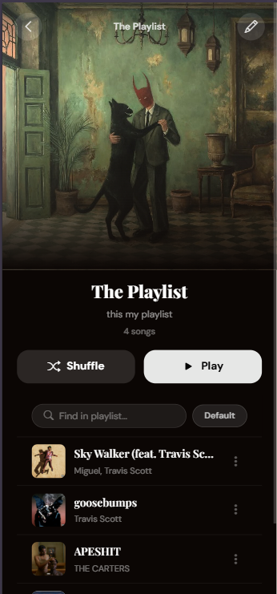 | 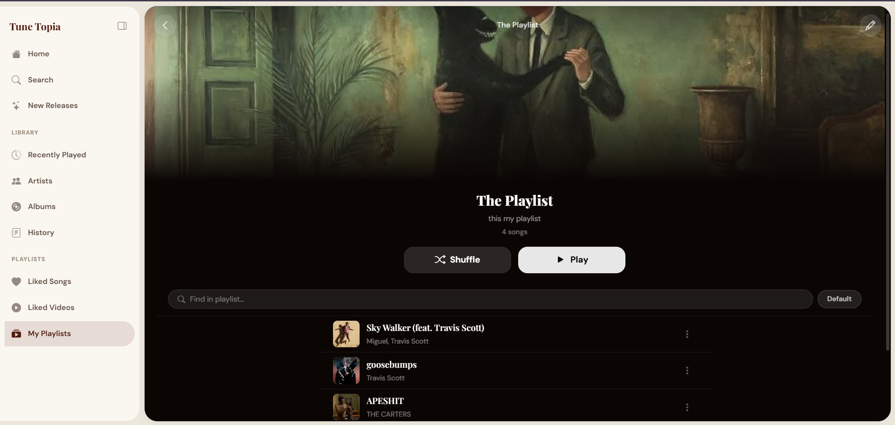 |
---

## Keyboard Shortcuts

| Key | Action |
|---|---|
| `Space` | Play / Pause |
| `→` | Seek +10s |
| `←` | Seek −10s |
| `Shift + →` | Next track |
| `Shift + ←` | Previous track |
| `↑` | Volume up |
| `↓` | Volume down |
| `M` | Mute |
| `S` | Toggle shuffle |
| `R` | Toggle repeat |

---
